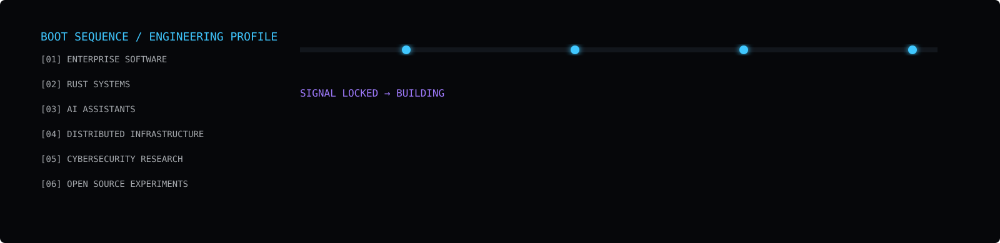
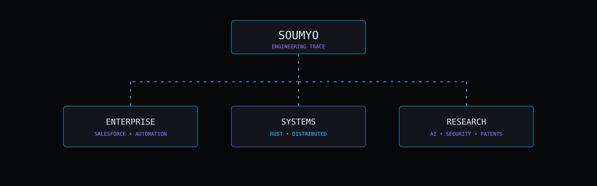
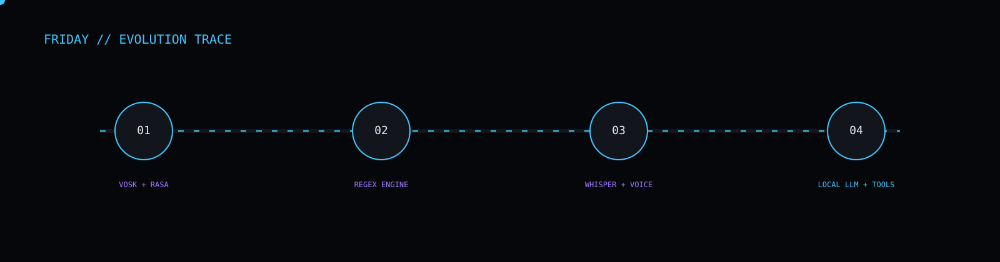
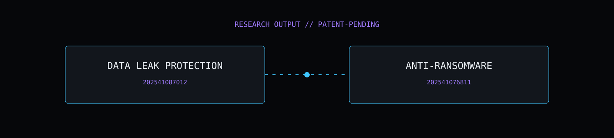
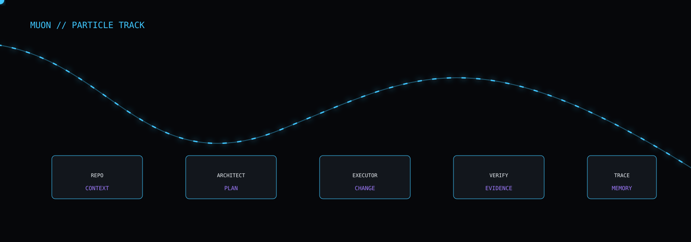
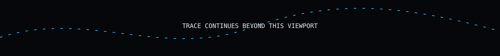

<div align="center">

<picture>
  <source media="(prefers-color-scheme: dark)" srcset="assets/hero.svg">
  
</picture>

<br>


<br><br>

<a href="https://github.com/microserv-net">
  
</a>


</div>

---

<div align="center">

# `ENGINEERING TRACE`

</div>

<div align="center">

</div>

```text
USER        Soumyo Deep Gupta
HANDLE      microserv-net
ROLE        Software Engineer
DOMAIN      Systems • Automation • AI • Enterprise Software
PRIMARY     Rust
SECONDARY   Python • Salesforce • SQL
STATUS      ███████████████░░░░░░░  BUILDING
```

I work across the entire path from **requirements → architecture → implementation → verification → deployment**.

Currently: enterprise software engineering at **Infosys**, while continuing to build systems around Rust, AI, real-time infrastructure, security research, and automation.

---

<div align="center">

# `SIGNAL PATH`

</div>

<div align="center">

</div>

## `01 // ENTERPRISE`

**Software Engineer @ Infosys**

Enterprise Salesforce solutions, automation, debugging, deployments, production support, and release-cycle engineering.

I have worked with:

- Salesforce Flows, Approval Processes and Lightning configuration
- Permissions, Profiles and Permission Sets
- SOQL, SOSL and Salesforce Inspector
- Git, Azure DevOps and VS Code
- Enterprise debugging and production issue resolution

---

## `02 // SYSTEMS`

```text
RUST
 ├── async systems
 ├── WebSockets
 ├── concurrency
 ├── high-performance data paths
 ├── distributed infrastructure
 └── systems architecture

PYTHON
 ├── ecosystem integration
 ├── data processing
 ├── automation
 └── AI applications
```

<div align="center">


</div>

---

<div align="center">

# `FRIDAY // FOUR GENERATIONS`

</div>

<div align="center">

</div>

My personal AI assistant evolved through four generations:

```text
GEN 01  →  VOSK + RASA
GEN 02  →  Lightweight regex intent engine
GEN 03  →  Whisper + speech recognition fine-tuned around my own voice
GEN 04  →  Native speech + local LLM + executable procedure generation
```

The important part is not any one implementation.

It is the direction:

> **From a voice interface → to a system that can understand intent and carry out work.**

---

<div align="center">

# `RESEARCH OUTPUT`

</div>

<div align="center">

</div>

```text
╔══════════════════════════════════════════════════════════╗
║                  02 PATENT APPLICATIONS                 ║
╚══════════════════════════════════════════════════════════╝

202541087012
System and Method for Preventing Data Leakage

202541076811
System and Method for Restricting Malware-Based Attack
```

Research areas include:

- Data leak protection that continues protecting information after it leaves the original environment
- Memory-hard and environment-aware verification
- Secure erasure and tamper detection
- Always-on in-memory blockchain architecture
- Crypto-ransomware resilience

---

<div align="center">

# `CURRENT EXPERIMENTS`

</div>

<div align="center">

</div>

## ☄ `MUON`

An experimental, repository-native AI-assisted software engineering system.

```text
REPOSITORY
    │
    ▼
ARCHITECT
    │
    ▼
EXECUTOR
    │
    ▼
VERIFY
    │
    ├── PASS ────────────────► COMPLETE
    │
    └── INCONSISTENCY
              │
              ▼
         RE-ANALYZE
              │
              ▼
      FULL CHANGE LEDGER
              │
              └──────────────► EXECUTOR
```

The philosophy is simple:

> **TIME > TOKENS**

If a difficult task takes hours but eventually produces the correct result, that can be a better trade than a fast system constrained by an artificial token budget.

MUON is one step toward a much larger long-term idea: an intelligence with persistent context, local hardware, tools, memory, and the ability to keep working.

---

## 🔥 `THERMITE`

A GitHub-native Rust build concept.

```text
SOURCE
  │
  ▼
POUR
  │
  ▼
╔══════════════╗
║   CRUCIBLE   ║
║              ║
║  RUST BUILD  ║
║              ║
╚══════╤═══════╝
       │
       ▼
     INGOT
```

The build is the **pour**.  
The environment is the **crucible**.  
The resulting artifact is the **ingot**.

---

## 🜃 `NYEDA`

**Not Your Every Day Archive**

Experimental security architecture exploring:

- Encryption
- Obfuscation
- Compiled modules
- Secure deletion
- Anti-reverse engineering
- Timelocked key derivation

---

## `SELECTED SYSTEMS`

### Real-time and automated trading infrastructure

Rust-based architecture involving:

- Distributed market-data collection
- WebSocket feeds
- Tick processing
- OHLCV generation
- Custom indicators
- Chart-integrated trading systems
- Automated strategies
- Historical data backfill
- Multi-user server architecture

### Pasta-Man

Open-source password manager created for the **FOSSIT 2024 Hackathon**, featuring layered security and both CLI and GUI interfaces.

---

<div align="center">

# `CONTRIBUTION TRACE`

</div>

<div align="center">

<picture>
  <source media="(prefers-color-scheme: dark)" srcset="https://raw.githubusercontent.com/microserv-net/microserv-net/output/github-contribution-grid-snake-dark.svg">
  <source media="(prefers-color-scheme: light)" srcset="https://raw.githubusercontent.com/microserv-net/microserv-net/output/github-contribution-grid-snake.svg">
  
</picture>

</div>

```text
THE TRACE DOES NOT REPRESENT EVERYTHING BEING BUILT.

ONLY THE PARTS THAT SURVIVED LONG ENOUGH
TO BE COMMITTED.
```

---

<div align="center">

# `GITHUB TELEMETRY`

<a href="https://github.com/microserv-net">

</a>

<a href="https://github.com/microserv-net">

</a>

<br>


</div>

---

<div align="center">

# `PHILOSOPHY`

</div>

```rust
fn build() {
    let mut system = System::new();

    while !system.is_interesting() {
        system.remove_assumptions();
        system.find_the_bottleneck();
        system.learn_the_constraints();
        system.rebuild();
    }
}
```

<div align="center">

```text
LANGUAGES CHANGE.
FRAMEWORKS DIE.
MODELS GET REPLACED.
INFRASTRUCTURE MOVES.

THE ABILITY TO UNDERSTAND A SYSTEM
AND BUILD WHAT DOES NOT EXIST YET
IS THE PART I AM KEEPING.
```



<br>

`TRACE TERMINATED · NOT THE WORK`

</div>
